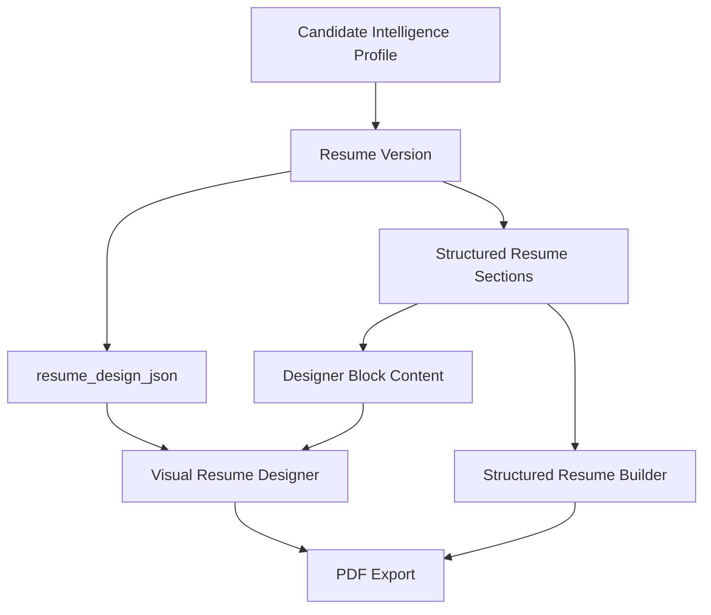

# Visual Resume Designer Architecture

## Purpose

The Visual Resume Designer is Jobvair's Canva-style resume design layer. It should let candidates create visually expressive PDF resumes while preserving Jobvair's structured Candidate Intelligence Profile as the source of truth.

This is separate from the current structured Resume Builder. The existing builder remains the ATS-safe workspace. The Visual Resume Designer becomes an advanced design workspace for users who want more creative control over layout, colors, blocks, pages, and visual presentation.

## Product Principle

Jobvair should support both:

1. ATS-safe structured resumes.
2. Visual, Canva-style PDF resumes.

The Candidate Intelligence Profile remains the canonical data source. Resume designs are presentation outputs. Visual freedom should not destroy the underlying semantic meaning of resume content.

## User Goals

Users should be able to:

- Move resume information anywhere on the page.
- Place name/contact information at the top, side, bottom, or inside a banner.
- Use sidebars, boxes, dividers, accent bands, and grouped sections.
- Choose font families, font sizes, font colors, and box colors.
- Create one-page or multi-page resumes.
- Start from visual templates and customize them.
- Preserve structured content for AI optimization and future ATS matching.
- Export a professional PDF.
- Understand when a design may be less ATS-friendly.

## Modes

### Structured Resume Builder

Purpose:

- ATS-friendly resumes.
- Profile-to-resume generation.
- AI resume optimization.
- Reliable section semantics.
- Current save/load behavior.

Characteristics:

- Section-based layout.
- Controlled ordering.
- One-column templates for now.
- Strong compatibility with profile data and AI recommendations.

### Visual Resume Designer

Purpose:

- Canva-style design freedom.
- Creative PDF resumes.
- User-controlled block placement.
- Advanced styling and multi-page presentation.

Characteristics:

- Page-based canvas.
- Absolute-positioned blocks.
- Drag, resize, align, group, duplicate, and layer controls.
- Style inspector for selected blocks.
- Optional ATS compatibility warnings.

## Core Architecture

The Visual Resume Designer should use a page/block model instead of the current section renderer model.



## Data Model

### Resume Design JSON

Initial shape:

```json
{
  "version": "resume_design_v1",
  "mode": "visual_designer",
  "page": {
    "size": "letter",
    "orientation": "portrait",
    "unit": "px",
    "width": 816,
    "height": 1056,
    "background": "#FFFFFF",
    "margin": 0
  },
  "theme": {
    "fontFamily": "Inter, sans-serif",
    "primaryColor": "#0F172A",
    "accentColor": "#00BFA5",
    "mutedColor": "#64748B",
    "borderColor": "#E2E8F0"
  },
  "pages": [
    {
      "id": "page_1",
      "pageNumber": 1,
      "background": "#FFFFFF",
      "blocks": []
    }
  ]
}
```

### Block Shape

```json
{
  "id": "block_name_1",
  "type": "profile_name",
  "linkedSectionType": "name",
  "linkedEntityId": null,
  "pageId": "page_1",
  "x": 56,
  "y": 48,
  "width": 480,
  "height": 48,
  "rotation": 0,
  "zIndex": 10,
  "locked": false,
  "visible": true,
  "content": {
    "text": "Heather Thayer"
  },
  "style": {
    "fontFamily": "Inter, sans-serif",
    "fontSize": 32,
    "fontWeight": 800,
    "color": "#0F172A",
    "backgroundColor": "transparent",
    "borderColor": "transparent",
    "borderWidth": 0,
    "borderRadius": 0,
    "padding": 0,
    "textAlign": "left"
  }
}
```

## Block Types

### Profile Blocks

- `profile_name`
- `profile_headline`
- `profile_contact`
- `profile_summary`

These should link back to the resume header/name section or profile data.

### Resume Section Blocks

- `summary_section`
- `skills_section`
- `experience_section`
- `education_section`
- `certifications_section`
- `custom_section`

These should preserve `linkedSectionType` and, where possible, `linkedSectionId`.

### Work Experience Blocks

- `job_group`
- `job_title`
- `job_company`
- `job_dates`
- `job_description`

These should link back to `work_experience_entries` when available.

### Design Blocks

- `text_box`
- `shape_box`
- `divider_line`
- `accent_band`
- `sidebar_band`
- `section_label`
- `icon_marker`

These are presentation-only and do not need Candidate Intelligence links.

### Future Blocks

- `profile_photo`
- `portfolio_link`
- `qr_code`
- `skill_meter`
- `timeline`
- `certification_badge`

These should wait until the base design model is stable.

## Designer UI Layout

Recommended layout:

- Main Jobvair navigation sidebar remains.
- Designer top toolbar for mode, undo/redo, zoom, page controls, preview, export.
- Left panel for templates, blocks, layers, and pages.
- Center canvas for the resume page.
- Right properties inspector for selected block styling.

Default desktop layout:

```text
+---------------------------------------------------------------+
| App Nav | Left Designer Panel | Canvas Workspace | Inspector  |
+---------------------------------------------------------------+
```

The canvas should scroll vertically and zoom, not force full-page horizontal overflow.

## Core Interactions

### Selection

- Clicking a block selects it.
- Selected block shows handles and outline.
- Shift-click can support multi-select later.
- Escape clears selection.

### Dragging

- Blocks can be dragged by their body unless editing text.
- Text editing mode should be distinct from move mode.
- Snap to page edges, center, and other blocks later.

### Resizing

- Selected blocks show corner and side handles.
- Text blocks can resize width/height.
- Shape blocks can resize freely.

### Layering

- Bring forward.
- Send backward.
- Bring to front.
- Send to back.
- Lock block.
- Hide block.

### Styling

Right inspector should support:

- Font family.
- Font size.
- Font weight.
- Text color.
- Background color.
- Border color.
- Border width.
- Border radius.
- Padding.
- Alignment.
- Opacity later.

### Pages

- Add page.
- Duplicate page.
- Delete page.
- Reorder pages later.
- Move block to page later.

## ATS Compatibility Strategy

Visual resumes can be less ATS-friendly. Jobvair should make this visible without blocking creative design.

Add an ATS guidance layer:

- `ats_safe`: blocks are mostly text and preserve reading order.
- `ats_moderate`: visual layout may be parsed imperfectly.
- `ats_risky`: heavy shapes, sidebars, multi-column placement, image-only text, or unusual ordering.

Warnings should be educational, not punitive.

Example:

```json
{
  "atsCompatibility": {
    "level": "moderate",
    "warnings": [
      "Sidebar layouts may parse out of order in some ATS systems.",
      "Keep a structured ATS version for online applications."
    ]
  }
}
```

## Persistence Strategy

### Phase 1 Prototype

No database schema change.

Store design state locally in React while validating the editor model.

### Phase 2 Safe Persistence

Use an existing JSON-capable field only if available and safe. Do not overload fields that currently drive structured resume sections unless clearly isolated.

Candidate field candidates to inspect before implementation:

- `resumes.template`
- `resumes.sections`
- `resume_sections.layout_config_json`
- any existing resume-level JSON config field

### Phase 3 Proper Persistence

Preferred future schema:

```sql
alter table public.resumes
add column if not exists design_json jsonb,
add column if not exists design_mode text default 'structured';
```

Optional future table:

```sql
create table public.resume_design_versions (
  id uuid primary key default gen_random_uuid(),
  resume_id uuid not null references public.resumes(id) on delete cascade,
  user_id uuid not null references auth.users(id) on delete cascade,
  design_json jsonb not null,
  version_label text,
  created_at timestamptz not null default now()
);
```

RLS should mirror resume ownership.

## Relationship To Current Resume Builder

Do not replace the current builder immediately.

The current builder should remain:

- The structured content editor.
- The safest ATS output.
- The source for AI resume assistance.
- The easiest path for profile-to-resume generation.

The Visual Designer should initially consume the same structured content and create a visual presentation layer on top.

## Recommended Folder Structure

```text
src/resume-designer/
  README.md
  designDefaults.js
  designSchema.js
  designBlocks.js
  designTemplates.js
  designerUtils.js
  components/
    VisualDesigner.jsx
    DesignerToolbar.jsx
    DesignerCanvas.jsx
    DesignerPage.jsx
    DesignerBlock.jsx
    DesignerInspector.jsx
    DesignerLayersPanel.jsx
    DesignerPagesPanel.jsx
    DesignerTemplatePanel.jsx
    ColorControl.jsx
    FontControl.jsx
    SizeControl.jsx
```

## Implementation Plan

### Phase 0: Planning And Guardrails

Scope:

- Document architecture.
- Confirm ATS-safe builder remains separate.
- Confirm no database change for the first prototype.

Deliverables:

- This document.
- Acceptance criteria for Phase 1.

Risks:

- Trying to make the current builder do too much.
- Losing structured resume semantics.

### Phase 1: Local Visual Designer Prototype

Scope:

- Add a Visual Designer mode in the Resume Builder.
- Keep current builder intact.
- Use local state only.
- One page only.
- Basic draggable blocks.
- No resizing yet if drag is the first validation goal.
- No persistence yet.

Blocks:

- Name/contact.
- Summary.
- Skills.
- Experience.
- Text box.
- Divider.
- Accent band.

UI:

- Left panel: blocks/layers.
- Center: page canvas.
- Right panel: selected block properties.

Acceptance criteria:

- User can open Visual Designer mode.
- User can move blocks around the page.
- User can select a block.
- User can edit basic style properties.
- Structured Resume Builder still works.
- `npm.cmd run build` passes.

### Phase 2: Block Resize And Styling

Scope:

- Resize handles.
- Better selection handles.
- Color controls.
- Font controls.
- Background/border controls.
- Duplicate/delete blocks.

Acceptance criteria:

- User can create a sidebar-style layout.
- User can make a banner header.
- User can change font and colors per block.
- No structured resume data is destroyed.

### Phase 3: Visual Templates

Scope:

- Add creative visual templates using `resume_design_json`.
- Generate initial blocks from structured resume sections.

Templates:

- Executive Sidebar.
- Technology Banner.
- Healthcare Clean Blocks.
- Government ATS Plain.
- Student Portfolio.

Acceptance criteria:

- Selecting a visual template creates a distinct layout.
- Templates are editable after selection.
- User can return to structured mode.

### Phase 4: Multi-Page Designer

Scope:

- Multiple pages.
- Add/delete/duplicate page.
- Page navigation.
- Page-aware PDF export.

Acceptance criteria:

- User can create a two-page resume.
- Export includes all pages.
- Page canvas remains performant.

### Phase 5: Persistence

Scope:

- Add or use safe persistence for `resume_design_json`.
- Save/load visual design separately from structured sections.
- Add migration only after prototype validation.

Acceptance criteria:

- User can save a visual design.
- User can reload and continue editing.
- Structured builder still loads the same resume sections.

### Phase 6: AI-Aware Designer

Scope:

- AI suggestions can target structured content and visual layout separately.
- Assistant can recommend layout changes, not silently apply them.

Examples:

- "Move skills higher for this job target."
- "Use a more ATS-safe layout for online applications."
- "Create a one-page executive version."

Acceptance criteria:

- AI recommendations remain explainable.
- User approves changes before applying.

## Technical Risks

### PDF Export

Absolute-positioned canvas output must export reliably. The current PDF path may need a separate visual designer export flow.

### Text Editing Versus Dragging

Text blocks need separate edit mode and move mode, or users will accidentally drag while typing.

### ATS Compatibility

Visual layouts can harm ATS parsing. Jobvair should encourage users to keep an ATS-safe version alongside creative versions.

### Mobile UX

The designer should be desktop-first. Mobile can support preview and light edits later.

### Persistence Timing

Do not add schema until the local prototype proves the design model.

## Recommended First Implementation Task

Build Phase 1 as a contained prototype:

- Create `src/resume-designer/`.
- Add `designDefaults.js` and `designSchema.js`.
- Add `VisualDesigner.jsx` with local state.
- Add a temporary mode toggle in `BuilderPage.jsx` between Structured Builder and Visual Designer.
- Render one page at letter ratio.
- Add draggable blocks for name/contact, summary, skills, experience, text box, divider, and accent band.
- Add a simple right inspector for color and font controls.
- No persistence.
- No database changes.
- No Stripe/Auth/ATS changes.

## Non-Goals For Phase 1

- No database migration.
- No Supabase writes.
- No two-column semantic parsing.
- No AI generation.
- No admin template builder.
- No mobile optimization.
- No paid/free gating.

## Decision

Proceed with a contained Visual Resume Designer prototype only after this architecture is approved. The prototype should validate interaction quality and design flexibility before persistence or template library expansion.